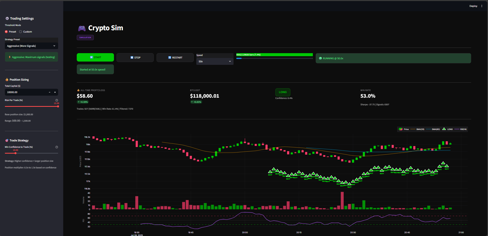

# 📈 AI-Powered Crypto Trading Dashboard

> **Real-time BTC trading signals powered by Deep Learning**  
> Temporal Convolutional Networks (TCN) + Live Market Data + Quantitative Analysis

<div align="center">
  
</div>

<div align="center">

[](https://www.python.org/downloads/)
[](https://pytorch.org/)
[](https://opensource.org/licenses/MIT)

</div>

---

## ✨ Features

### 🎯 **Intelligent Trading Signals**

- **ML-Powered Predictions**: Deep learning TCN model trained on 90 days of BTC price data
- **LONG/SHORT/NEUTRAL signals** with confidence scores
- **Real-time inference** on live market data
- **Customizable thresholds** for aggressive/balanced/conservative strategies

### 💰 **Portfolio Management**

- **Live PnL tracking** with portfolio growth percentage
- **Win rate statistics** (461W/281L = 62.1% in demo)
- **Position sizing** recommendations based on Kelly Criterion
- **Risk management** controls (capital allocation, risk per trade)

### 📊 **Professional Dashboard**

- **Robinhood-inspired UI** with TradingView-style charts
- **Multiple timeframe analysis**: Price action, Volume, RSI, Moving Averages
- **Interactive controls**: Threshold tuning, position sizing, speed controls
- **Simulation mode** for rapid backtesting (1x to 50x speed)

### ⚡ **Fast Iteration**

- **Simulation mode**: Test strategies on 3 months of historical data in minutes
- **No VPN required**: Works completely offline with downloaded data
- **Instant feedback**: See profitability metrics update in real-time

---

## 🚀 Quick Start

### **Option 1: Simulation Mode (Recommended for Testing)**

```powershell
# 1. Setup environment
python -m venv .venv
.\.venv\Scripts\Activate.ps1
pip install -r alpha_tcn_starter/requirements.txt

# 2. Download BTC data (3 months recommended)
cd alpha_tcn_starter
python scripts/download_binance_historical.py --symbol BTCUSDT --days 90 --out data/btcusdt_1m.parquet

# 3. Train the model
python src/train.py --config configs/default.yaml

# 4. Launch simulation dashboard
streamlit run dashboard/app_sim.py
```

**🎮 Simulation Mode**: Replay historical data at 50x speed to see how your strategy performs!

### **Option 2: Live Trading Dashboard**

```powershell
# After training (steps 1-3 above)
streamlit run dashboard/app.py
```

**📡 Live Mode**: Connect to Binance WebSocket for real-time predictions (requires VPN in some regions).

---

## 📊 Dashboard Controls

### **Trading Settings** (Left Sidebar)

#### **Threshold Mode**

- **Preset Strategies**:
  - 🛡️ **Conservative**: (L>0.55, S<0.45) → Fewer, higher-quality signals
  - ⚖️ **Balanced**: (L>0.52, S<0.48) → Medium signal frequency
  - ⚡ **Aggressive**: (L>0.505, S<0.495) → Maximum signals for testing
- **Custom Mode**: Manual threshold tuning (0.01 to 0.99)

#### **Position Sizing**

- **Total Capital**: $100 to $10M
- **Risk Per Trade**: 0.1% to 20% of capital
- **Base Position Size**: Calculated as `capital × risk_per_trade`
- **Position Multiplier**: 0.5x to 1.5x based on model confidence

#### **Trade Strategy**

- **Min Confidence Filter**: Skip trades below confidence threshold (0-50%)
- **Signal Quality**: Trade only when model is sufficiently confident

### **Simulation Controls**

- ▶️ **START**: Begin simulation
- ⏸️ **STOP**: Pause at current bar
- 🔄 **RESTART**: Reset to beginning
- **Speed**: 1x, 5x, 10x, **50x** (3 months in ~5 minutes!)

---

## 📈 Key Metrics

### **Portfolio Performance**

- **ALL-TIME PROFIT/LOSS**: Total dollar PnL with portfolio growth %
- **Win Rate**: Percentage of profitable trades
- **Total Trades**: Number of executed signals (excludes NEUTRAL)
- **Sharpe Ratio**: Risk-adjusted returns

### **Live Signals**

- **Current Signal**: LONG/SHORT/NEUTRAL with confidence %
- **Position Size**: Dollar amount recommended for entry
- **Recent Signals**: Last 20 trades with individual PnL

### **Charts**

- **Candlestick Chart**: OHLC with SMA(20) and SMA(60)
- **Volume Bars**: Color-coded by direction
- **RSI Indicator**: Overbought/oversold levels
- **Signal Markers**: Visual buy/sell annotations

---

## 🧠 Model Architecture

### **Temporal Convolutional Network (TCN)**

- **Input Features** (9 total):

  - Price returns (1, 5, 15-minute windows)
  - Rolling volatility (20, 60-period)
  - Dollar volume
  - Taker buy ratio
  - High-low range
  - Trend indicators

- **Model Structure**:

  - 3 TCN blocks with dilated convolutions
  - Exponentially increasing dilation (1, 2, 4, 8...)
  - Receptive field: 100+ bars (1.5+ hours of history)
  - Output: Binary classification (price up/down in next 10 minutes)

- **Training**:
  - Loss: Binary Cross-Entropy with Logits
  - Optimizer: AdamW with gradient clipping
  - Early stopping on validation AUC
  - ~130k training samples (90 days of 1-min data)

### **Why TCN?**

- ✅ **Causal**: No lookahead bias (critical for trading)
- ✅ **Fast inference**: Lightweight, CPU-friendly
- ✅ **Long memory**: Captures patterns across hours
- ✅ **Parallelizable**: Fast training with batch processing

---

## 🎯 Use Cases

- 🔬 **Alpha Research**: Test short-horizon trading ideas on real BTC data
- 📉 **Quantitative Trading**: Systematic entry/exit signals with risk management
- 🧪 **Strategy Backtesting**: Rapid iteration with simulation mode
- 📊 **Market Analysis**: Visualize price action, volume, and momentum
- 🤖 **ML Experimentation**: Baseline for more complex models (Transformers, LSTMs)

---

## 📁 Project Structure

```
alpha_tcn_starter/
├── configs/
│   ├── default.yaml      # Training configuration
│   └── live.yaml         # Live/simulation settings
├── dashboard/
│   ├── app.py           # Live WebSocket dashboard
│   └── app_sim.py       # Simulation dashboard (recommended)
├── data/
│   └── btcusdt_1m.parquet   # Historical BTC data
├── artifacts/
│   ├── model.pt         # Trained TCN model
│   ├── scaler.pkl       # Feature normalization
│   └── meta.json        # Training metadata
├── src/
│   ├── model.py         # TCN architecture
│   ├── data.py          # Data loading & preprocessing
│   ├── train.py         # Training loop
│   ├── eval.py          # Model evaluation
│   ├── inference.py     # Real-time inference engine
│   └── simulation_stream.py  # Historical data replay
└── scripts/
    ├── download_binance_historical.py  # Data downloader
    └── assemble_binance_bars.py       # Feature engineering
```

---

## 📖 Detailed Guides

- **[LIVE_TRADING_GUIDE.md](LIVE_TRADING_GUIDE.md)** - WebSocket setup, signal interpretation, best practices
- **[SIMULATION_GUIDE.md](SIMULATION_GUIDE.md)** - Fast backtesting, speed controls, strategy testing
- **[QUICKSTART.md](QUICKSTART.md)** - Step-by-step installation and first run
- **[PROJECT_SUMMARY.md](PROJECT_SUMMARY.md)** - Technical architecture and implementation details

---

## ⚠️ Important Disclaimers

### **📉 Trading Risk**

> ⚠️ **This is an educational project, not financial advice**
>
> - Past performance does NOT guarantee future results
> - Cryptocurrency trading carries substantial risk
> - Never risk more than you can afford to lose
> - This model has NOT been validated for real money trading
> - Market conditions change; models can become obsolete

### **🤖 Model Limitations**

- **Overfitting Risk**: Model trained on 90 days may not generalize
- **Market Regime Changes**: Crypto volatility can shift rapidly
- **Transaction Costs**: Real trading has fees, slippage, and spreads
- **Execution Gap**: Live trading is harder than simulation
- **No Guarantees**: High win rate in simulation ≠ guaranteed profit

### **💡 Use This For**

- ✅ Learning ML-powered trading systems
- ✅ Experimenting with quantitative strategies
- ✅ Understanding TCN architectures
- ✅ Backtesting trading ideas

### **🚫 Do NOT Use This For**

- ❌ Live trading with real money (without extensive validation)
- ❌ Financial advice or investment decisions
- ❌ Expecting guaranteed returns

---

## 🚀 Future Improvements

### **Potential Enhancements**

- [ ] **Multi-asset support**: ETH, SOL, other cryptos
- [ ] **More features**: Order book data, social sentiment, on-chain metrics
- [ ] **Better models**: Transformers, LSTMs, ensemble methods
- [ ] **Auto-trading**: Paper trading integration, Binance API execution
- [ ] **Advanced strategies**: Mean reversion, momentum, volatility targeting
- [ ] **Risk metrics**: Sortino ratio, max drawdown, VaR
- [ ] **Flask + React**: Professional web stack for production deployment

### **Contributions Welcome!**

Have ideas? Open an issue or submit a PR!

---

## 📝 License

MIT License - see [LICENSE](LICENSE) for details

---

## 🙏 Acknowledgments

- **Binance API** for historical market data
- **PyTorch** for deep learning framework
- **Streamlit** for rapid dashboard prototyping
- **Plotly** for interactive charts

---

<div align="center">
  
**⭐ If this project helped you, please star the repo!**

Built with ❤️ for quantitative traders and ML enthusiasts

</div>
